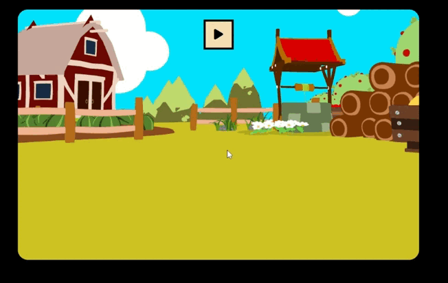

<h1 align="center">🥕 JavaScript를 이용한 당근 게임 🕷</h1>

### ✏ 프로젝트
- 게임은 3라운드로 구성되며, 주어진 시간 내에 벌레를 피해 당근을 모두 클릭하면 승리하는 게임입니다.
- 이 프로젝트는 드림코딩 아카데미의 과정 중 하나로 **기능을 확장한 버전**입니다.

### ✏ 사용기술

  
  

### 💻 How To Use
- 당근을 모두 클릭하면 win, 벌레를 하나라도 선택할 경우 lose
- 제한된 시간이 지나도 lose
- play 버튼을 통해 새로고침하여 다시 게임을 replay 할 수 있도록 처리
   + continue 버튼으로 게임 재개할 수 있는 코드 추가
- 총 3라운드 구성 : 1,2 라운드 성공 시 Next Level로 넘어가도록 처리

### 💡 Future Scope
- level 별로 당근과 벌레 갯수 증가시키기
- 벌레가 영역에서 움직일 수 있도록 처리하기

